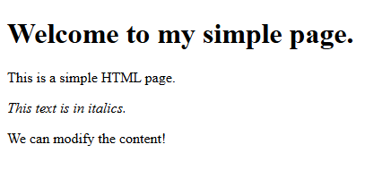

Uma Página Simples

Projeto desenvolvido utilizando apenas HTML, com foco em praticar a estrutura básica de uma página web.

Tecnologias utilizadas
HTML5
Estrutura utilizada

No <body> foram utilizadas as seguintes tags:

<h1> para o título principal

 para os parágrafos
<i> para texto em itálico

Além disso, a página possui um <head> contendo o título da aba do navegador.

Objetivo

Praticar conceitos básicos de estruturação de páginas HTML de forma simples e organizada.
